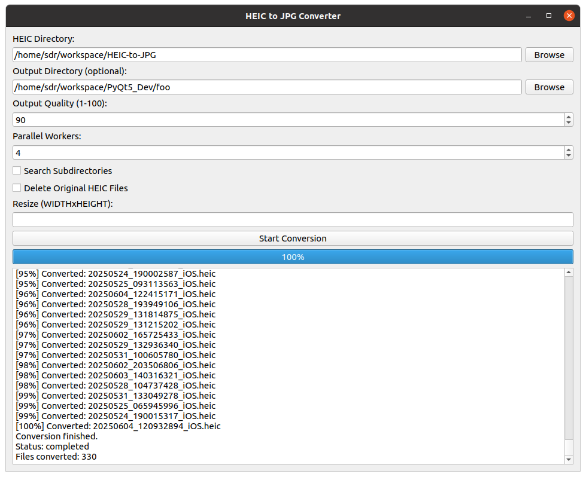

# HEIC to JPG Converter Application

This is a Python Qt5 application which converts iPhone HEIC to JPG images.  



## Quick Start

Create Python Virtual Environment and start `heic2jpg_gui.py` application:

```bash
python3 -m venv venv
source ./venv/bin/activate
pip install --upgrade pip setuptools wheel
pip3 install -r requirements.txt
python3 heic2jpg_gui.py
```


## Detailed Instructions

To use the application, create a Python Virtual Environment:

```bash
python -m venv venv
```

Then start the Python Virtual Environment:

```bash
source ./venv/bin/activate
```

To exit the Python Virtual Environment:

```bash
deactivate
```

Install the required packages:

```bash
pip install -r requirements.txt
```

